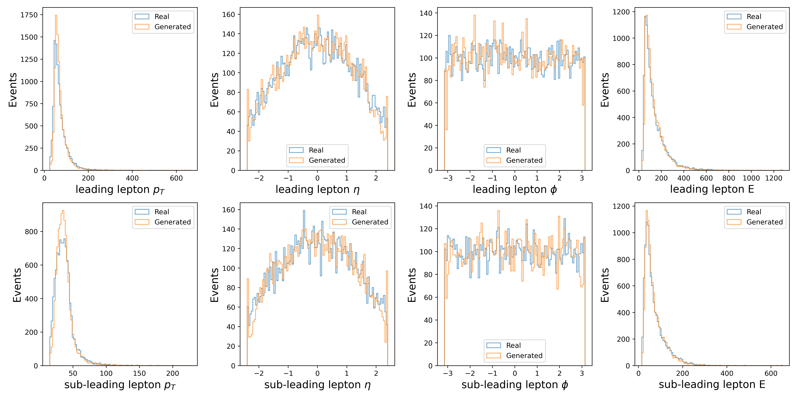
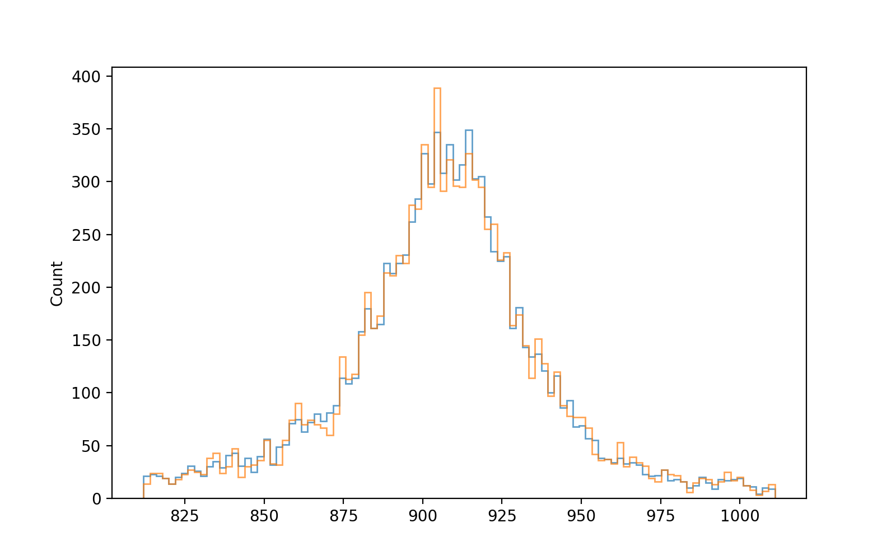
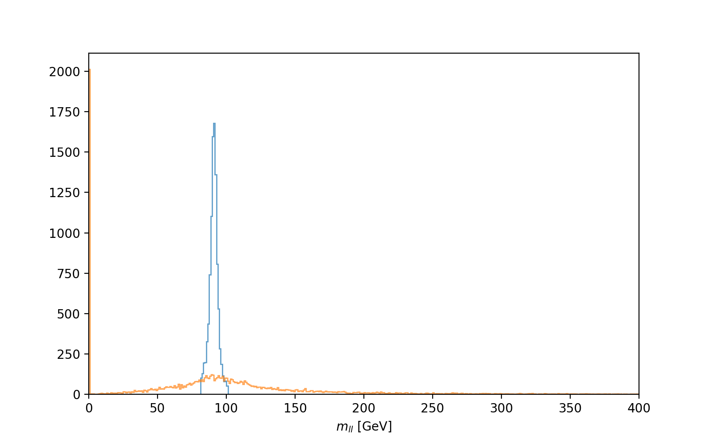

# Using TorchCFM: a Conditional Flow Matching library for background estimation

WORK IN PROGRESS

Check out the original repo here for more functionality here : [https://github.com/atong01/conditional-flow-matching](https://github.com/atong01/conditional-flow-matching)

We use the tabular data generation jupyter notebook located in `examples/tabular/` to demonstrate how to use TorchCFM for generation of background events, specifically the Drell-Yan process.

The generated distributions include $p_T$, $\eta$ and $\phi$ of the leptons, as well as the invariant mass of the dilepton system.

The invariant mass calculated from the generated distribution:

